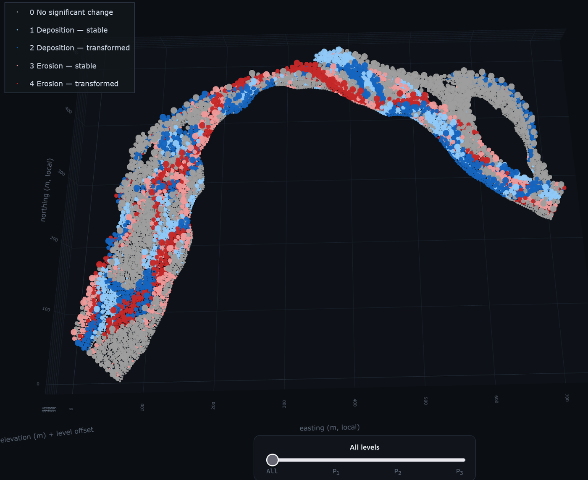
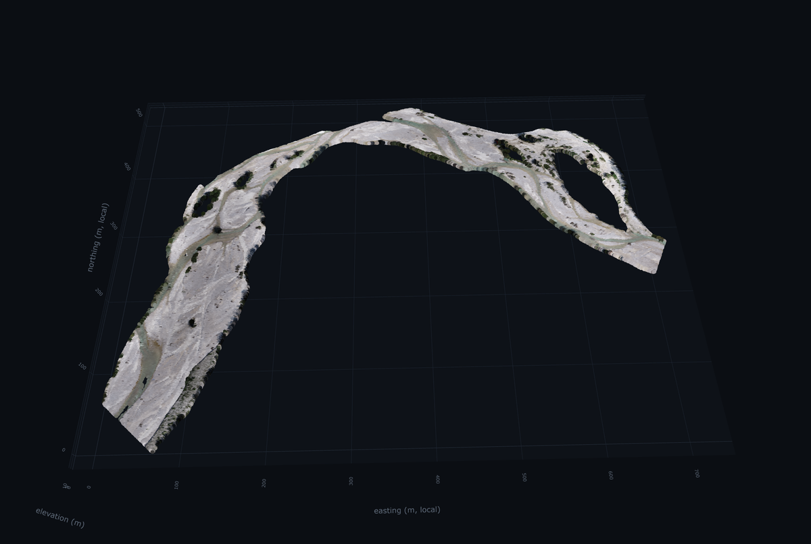
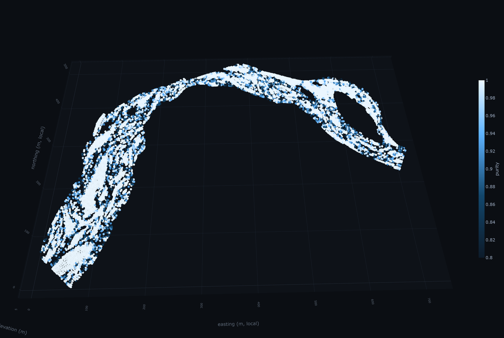

# Superpoint Graph Viewer

An interactive, browser-based view of a **nested acyclic graph** (NAG) of
topographic change on the river Isar, built from two lidar surveys flown in
August and November 2024.

It draws 150,000 voxels and the 10,061 superpoints above them across four
levels of a hierarchical partition, and lets the M3C2 distance, the four
components of the change tensor, the label purity, the purity gate and the
digitised water's edge of either epoch be switched on as colour. It is a static
page: no server, no build step, no package manager, and Plotly is vendored
locally, so it also runs from a memory stick with no internet connection.

It accompanies an MSc Cartography thesis, *Topographic Change Segmentation from
Multi-Temporal Point Clouds using Superpoint Graphs* (Technical University of
Munich, 2026).

<!-- Replace USER with your GitHub account name, here and in the three places
     further down. The repository name is already filled in. -->
**→ [Open the viewer](To be updated)**



| | |
|---|---|
|  |  |
| 150,000 voxels in true colour | superpoints by purity, with the gate applied |

## What it shows

- **Four partition levels.** P₀ voxels, then P₁, P₂ and P₃ superpoints, each
  selectable on its own, or **stacked** one above another with every unit joined
  by a line to its parent — a picture of the hierarchy rather than a diagram of
  it.
- **Eleven attributes as colour.** True colour, elevation, the five-class change
  label, the M3C2 distance, the four change-tensor components (translation,
  rotation, stretch, distortion), the label purity, and the purity gate as a
  pass or fail.
- **The purity gate at two levels.** At P₁ as the verdict on each unit, and at
  P₀ pushed down onto the voxels, so the discarded third can be seen as ground
  rather than as absent units.
- **Both water's edges.** The digitised extent of each survey epoch, draped onto
  the surface, switchable independently.
- **A recordable viewpoint.** The camera readout can be clicked to copy a
  camera, and pasted back to reproduce a view exactly.
- **Phones and tablets**, on the same URL and the same data as the desktop.

## Running it locally

The page fetches binary buffers with `fetch()`, which browsers block over
`file://`. It has to be served over `http://`. From the repository root:

```bash
python -m http.server 8629
```

then open <http://localhost:8629>. Any static server will do — `npx serve`,
`php -S localhost:8629`, VS Code's Live Server — nothing here is specific to
Python beyond the data export step.

## Publishing it on GitHub Pages

The repository is laid out to be served as it stands, with `index.html` at the
root and every path relative, so it works from a project subpath such as
`https://USER.github.io/isar-superpoint-viewer/` and not only from a domain root.

Create a repository and push this folder as its root:

```bash
git init -b main
git add .
git commit -m "Superpoint graph viewer"
git remote add origin https://github.com/USER/isar-superpoint-viewer.git
git push -u origin main
```

Then open **Settings → Pages**, set **Source** to *Deploy from a branch*, and
choose `main` and `/ (root)`. No workflow file and no build step are needed.
Wait for the first deployment, open the site, and verify the published copy
rather than trusting it — see below.

`.nojekyll` is present so GitHub serves the folder verbatim instead of running
it through Jekyll, which would otherwise skip any path beginning with an
underscore.

**The whole payload is about 13 MB**, of which 4.5 MB is Plotly and 7 MB is the
data. That is well inside every GitHub limit (100 MB per file, 1 GB per Pages
site), but it is a real download on a mobile connection, so the first load is
not instant.

## Verifying the package

```bash
python tools/check_package.py
```

Run it before pushing, and again after cloning the repository somewhere else.
The second run is the one that matters: it is the only thing that proves the
data survived the round trip through Git. It checks four failure modes, all of
which are silent — the page still loads, and only the picture is wrong.

- **Byte integrity**, against `data/checksums.sha256`.
- **Case**, because Windows and macOS resolve paths case-insensitively and
  GitHub Pages serves from Linux, which does not. A reference to
  `Data/manifest.json` works locally and 404s once hosted.
- **Manifest agreement**, so no typed array is read past the end of its buffer.
- **Root-relative URLs**, which resolve to the domain root and would break the
  project subpath.

### Why `.gitattributes` is not optional

Git decides text-versus-binary by content, and with `core.autocrlf=true` — the
Git for Windows default — it rewrites line endings in anything it judges to be
text. Doing that to a raw buffer shifts every value after the first CR-LF pair.

As the data stands, all 28 buffers are classified correctly and a round trip
returns each one byte-identical. But `is_binary()` in Git's `convert.c` accepts
a file as binary on either of two grounds: a NUL byte, or the ratio test
`(printable >> 7) < nonprintable`. Twenty-seven buffers carry NUL bytes and are
safe unconditionally. `level0_rgb.bin` contains no NUL byte at all — it is
150,000 uint8 RGB triplets — and is safe only on the second ground, by 9,849
unprintable bytes against a threshold of 3,435.

That threshold is a property of the pixel values, not of the format: a re-export
with a lighter colour ramp carries fewer bytes below 32, and if the count fell
under about 3,500 the file would flip to *text* and be silently corrupted on the
next clone. The rules in `.gitattributes` remove the dependency on the data; the
checksums detect the failure if those rules are ever dropped.

## What is in the repository

```
index.html          page shell
style.css           dark theme, three responsive layouts
app.js              everything else: fetch, colour, traces, UI
favicon.svg
data/               generated payload, about 7 MB (see below)
vendor/             plotly-2.35.2.min.js, vendored for offline use
tools/
  export_nag.py     regenerates data/ from the source .h5
  check_package.py  verifies the package is complete and host-safe
docs/               README screenshots only; not used by the page
```

`app.js` reads top to bottom in the order it runs: typed-array fetch, colour
helpers, one trace builder per colour mode, the two render paths (a single
level, and the stacked hierarchy), then the UI wiring.

## Regenerating the data

Everything under `data/` is generated by `tools/export_nag.py` from
`isar_spg.h5`. That file is roughly 352 MB and is **not** in this repository: it
is too large for Git and is archived separately. The script needs `h5py` and
`numpy` only, no `torch`, so it runs outside the SPT container:

```bash
python tools/export_nag.py --h5 /path/to/isar_spg.h5
```

`NAG_H5`, `NAG_CONFIG` and `NAG_OUT` do the same job as environment variables.
Re-run it whenever the partition changes, then regenerate the checksums:

```bash
python tools/check_package.py --write
```

The export prints the purity-gate retention it computed, which should read
**6,818 / 10,061 (67.8 %)**. If that number ever drifts from what the thesis
reports, the partition has changed and the two need reconciling before the
viewer can be trusted.

### What is computed here rather than copied from the file

Two things the export script does *not* take directly from the `.h5`, because
the raw columns would be wrong for them:

- **The per-voxel class label is rebuilt** from `Change_Code` and
  `is_transformed` (dead band 0.25), not read from `Class5_Code`. Voxelisation
  averages `Class5_Code` along with everything else, and because the five-class
  code is ordinal in name only, the average of two real classes can land on a
  third that neither voxel belongs to.
- **Every P₁–P₃ unit's majority label and purity are aggregated from that
  rebuilt voxel label**, chained through `super_index` (P₀ → P₁ → P₂ → P₃), the
  same chain the thesis's partition figure walks.

Both are cross-checked: the script cannot change silently, because a future edit
that breaks either one stops the purity-gate count matching the thesis.

## Colour ranges for the change fields

M3C2 distance, translation, rotation, stretch and distortion are **not** scaled
to the data's own minimum and maximum. A handful of points carry genuine but
extreme values — the degenerate-normal boundary population the thesis excludes
by significance test — and a small number of them would otherwise wash the whole
scale out to white. The four tensor components use fixed saturation ranges
(±1.0 m, ±0.3, ±0.05, ±0.5); M3C2 is given translation's range, since
translation is the direct analogue of the M3C2 distance. An outlier still
renders, clipped to the end colour exactly as CloudCompare does for the static
figure — never hidden.

## The stack view

Selecting **stack** instead of a single level draws P₁, P₂ and P₃ one above
another, offset in Z by the level-spacing slider, with a line from every unit to
its parent's centroid.

A second slider appears at the bottom in this mode only, with four stops: All,
P₁, P₂, P₃. Moving off *All* greys out the two levels not in focus — flat
colour, dimmed opacity — without hiding or rebuilding them, so the shape of the
hierarchy stays visible while attention narrows to one level. This is a pure
`Plotly.restyle` against colours captured when the traces were first built
(`applyStackFocus` in `app.js`); no data is re-fetched when it moves.

## The river extent overlays

`data/river_aug.json` and `data/river_nov.json` are the digitised water's edge
in each epoch, shifted into the viewer's local frame by `manifest.ply_offset`
and **draped**: every vertex takes the elevation of the nearest P₁ centroid, so
a line lies on the surface instead of floating at one height. August is 21 rings
(10 of them holes — dry bars inside the wetted area) covering 16,269 m²;
November is 12 rings covering 26,108 m². Holes are drawn in the colour of their
outer ring, because a bar edge is as much a class margin as the outer bank is.

They exist to make one argument visible. A unit is *stable* where the two epochs
agree and *transformed* where they differ, so a unit lying across either line
holds two classes and cannot be pure. Switch both on with the P₁ colouring set
to **Purity gate**: the discarded units sit on the lines, and the ground between
them is the transformed zone. At P₀ the mode **Purity gate of parent P₁** pushes
each unit's verdict down onto its voxels, showing the same relationship as
ground rather than as units.

Colours come from `manifest.overlays.<key>.color` (August `#ffb04d`, November
`#c084fc`), which is also what the sidebar key swatches read, so the legend and
the scene cannot disagree. Both are chosen away from the class palette's greys,
blues and reds so neither extent can be read as a class, and away from each
other in hue and lightness. Adding a third extent needs no change to the viewer
beyond a checkbox: the overlay list is driven by the manifest. If `manifest.json`
carries no `overlays` key the checkboxes hide themselves rather than failing on
click, so an older export still works.

The overlays are written by a script that also measures what they show, so the
picture and the numbers reported in the thesis cannot drift apart. That script
lives with the thesis analysis code rather than in this repository, since it
reads the original shapefiles.

## Camera readout

Top right of the plot, below the Plotly modebar, in dim grey:

```
eye  -2.008 -2.682  1.375
rot -98.3°  34.3°   0.0°
zoom ×1.00  dist 2.677
```

`eye` is the camera position in Plotly's **normalised scene units**, not metres:
the scene box is roughly [-1, 1] whatever the reach measures on the ground.
`rot` is azimuth, elevation and roll in degrees, derived from the eye, the
centre and the up vector, since a Plotly camera is a position and carries no
rotation triple of its own. Azimuth is compass-style about the vertical,
elevation is height above the horizontal plane, and roll is measured against
world up, so it reads 0 for every camera this viewer sets. `zoom` is relative to
the reset view, so ×1.00 is what **Reset view** gives and larger is closer;
`dist` is the raw eye distance the clamp acts on.

**Click the readout to copy the camera.** It yields the readable line, and the
Plotly JSON on a second line — which is the part worth having, because pasting
it back reproduces a viewpoint exactly. That is how `DEFAULT_CAMERA` in `app.js`
was set: framed by hand, copied off the readout, pasted in. To change the reset
view, do the same and replace `DEFAULT_CAMERA`, keeping every decimal, since
rounding them moves the framing.

**Copy the whole JSON, `center` included.** Panning moves the centre off the
origin, and `dist` is the eye's distance *from the centre*, not from the origin.
Both the zoom factor and the `MIN_EYE_DIST`/`MAX_EYE_DIST` clamp measure it that
way. Taking only `eye` from a panned camera gives a different view and a zoom
factor that no longer reads ×1.00 at the reset view.

Copying uses the async clipboard API and falls back to a hidden textarea when
that is unavailable *or rejected* — the latter being the `file://` case, where
there is no secure context.

## Camera zoom

The scene camera's `eye` is clamped to a minimum and maximum distance from its
centre (`MIN_EYE_DIST` / `MAX_EYE_DIST` in `app.js`, enforced in the
`plotly_relayout` handler inside `draw()`). Plotly's 3D camera has no discrete
zoom level the way a slippy map does — `eye` is a continuous distance in the
scene's own normalised units — so these bounds were picked empirically around
the default camera's distance rather than mapped onto any particular number.

## Phones and tablets

Three layout regimes, not one breakpoint, because the sidebar and the plot stop
working at different widths:

| Viewport | Sidebar | Notes |
|---|---|---|
| > 1040 px | 300 px, fixed | the desktop layout |
| 820–1040 px | 260 px, fixed | narrowed, still side by side |
| ≤ 820 px | off-canvas drawer | ☰ in the topbar opens it |

The drawer is **translated off-screen, not collapsed out of the flex row**. That
is deliberate: Plotly measures its container on resize, and a sidebar taking
part in the layout would make the WebGL canvas change width every time the menu
opened. Off-canvas, the plot is the full width of the viewport at all times and
opening the menu costs no redraw.

It closes on a tap of the scrim, on `Escape`, and — the one that matters on a
phone — as soon as a level or a colour mode is chosen, so the result is visible
rather than the menu it was chosen from. Crossing 820 px in either direction
drops the drawer state and redraws, because the modebar and the P₀ sample below
both depend on which side of it the viewport is.

Below 560 px the level tabs become one horizontal scroll-snap row instead of a
grid, and the topbar buttons shrink while the title truncates — the title being
the only thing there that can be lost without losing a control. A separate
`max-height: 480px` rule handles a phone in landscape, where the topbar thins to
44 px. `pointer: coarse` enlarges the tap targets independently of width, which
catches a tablet wide enough to keep the sidebar but with no hover state.

**P₀ is thinned again on small screens**, to about 37,500 points from the
exported 150,000. The binding constraint is not the GPU: true colour is the
default mode and builds one `rgb(r,g,b)` *string* per point, so 150,000 points
is a multi-second stall on a mid-range phone. The thinning is a fixed stride
over an already random sample, so it stays a uniform sample of the reach, and
the level hint reports the number actually drawn — never a number that was true
on a different device. Only P₀ is touched; P₁ is 10,061 points and the levels
above it are smaller.

The Plotly modebar is switched off below 820 px. Its buttons are about 20 px,
they are revealed on hover, and they sit on top of the camera readout; orbit,
pan and pinch-zoom all work by touch without it.

## Saving a screenshot

The **Screenshot** button writes a PNG of the 3D view straight to the browser's
download folder, at **twice** the on-screen pixel dimensions (`SHOT_SCALE` in
`app.js`). At a maximised window that lands near 2400 px wide, roughly 300 dpi
across a 15 cm text block. Scaling multiplies the pixels without changing the
layout, so text and line weights keep their proportions.

The file is named after the state that produced it, so a folder of captures can
still be told apart later:

| State | File |
|---|---|
| P₀, true colour | `viewer_P0_rgb.png` |
| P₁, purity, gate filter on | `viewer_P1_kept_purity.png` |
| P₁, gate colouring, extent on | `viewer_P1_river_kept.png` |
| stack, P₂ focused, class | `viewer_stack_focus-P2_class.png` |

**Shift-click** the button to type a name instead.

Two things it deliberately does not do. It captures the **plot only** — the
sidebar, the stack-focus bar and the hover readout are ordinary DOM elements
beside or over the canvas, and are not part of the image, which is usually what
a figure wants; for a capture that has to show the interface, use the operating
system's own screen capture. And it does not re-render onto white: the axis
titles, tick labels and grid are all styled for the dark theme and would come
back invisible against a white background.

## Editing the page

If `app.js` or `style.css` is edited while a browser tab is already open, a
plain reload can serve a cached copy — browsers sometimes cache a static JS file
heuristically even with no `Cache-Control` header, and will not always
revalidate on a normal reload. Bump the `?v=N` query string on the `<script>`
and `<link>` tags in `index.html`, or open the page in a new tab, if a change
does not seem to take effect. This matters on GitHub Pages too, which sets a
ten-minute cache lifetime on its assets.

## Known limitation

Point-and-click inspection (`onPointClick` in `app.js`, wired to Plotly's
`plotly_click`) is implemented and the logic is straightforward, but it could
not be mechanically verified: Plotly's WebGL (`scatter3d`) hit-testing appears
to depend on hover state that a real mouse builds up by moving across the canvas
before clicking, which an automated click does not always establish. Native
hover tooltips, which need no click, are confirmed working for every layer and
colour mode. If clicking a point does not populate the readout in the
bottom-left corner, hovering will still show the same voxel or unit id, class,
purity and voxel count.

## Licence

The code — `index.html`, `style.css`, `app.js`, `favicon.svg` and `tools/` — is
MIT, in `LICENSE`. The data under `data/`, and the screenshots in `docs/`, are
CC BY 4.0; see `LICENSE-DATA.md` for how to credit them.

## Credits

The surveys and the partition are the author's own work within the thesis.
Discharge records for the survey interval are published by the Bayerisches
Landesamt für Umwelt. [Plotly.js](https://plotly.com/javascript/) is vendored
under the MIT licence; its licence text travels inside the minified bundle.

## Citation

See `CITATION.cff`, which GitHub renders as a **Cite this repository** button.
